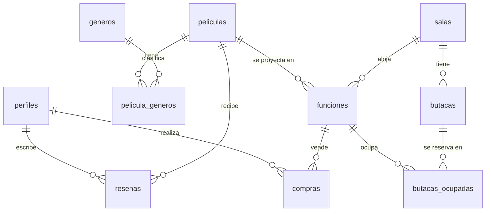

# CineApp · Documento técnico

Cómo levantar el proyecto, cómo está construido y por qué se resolvió así.
Qué hace la aplicación y para quién está en [FUNCIONAL.md](FUNCIONAL.md)

## Índice

1. [Cómo levantar el proyecto](#1-cómo-levantar-el-proyecto)
2. [Arquitectura](#2-arquitectura)
3. [Decisiones técnicas](#3-decisiones-técnicas)
4. [Limitaciones conocidas](#4-limitaciones-conocidas)

---

## 1. Cómo levantar el proyecto

### Requisitos

- Node.js 20.19 o superior
- Una cuenta gratuita en [Supabase](https://supabase.com)

### Pasos

1. Instalar dependencias:

   ```bash
   npm install
   ```

2. Crear un proyecto en Supabase con las tablas y funciones RPC que se listan en [Modelo de datos](#modelo-de-datos).
3. Copiar en `src/environments/environment.ts` y `src/environments/environment.development.ts` la _Project URL_ y la _publishable (anon) key_ de **Project Settings > API**.
4. En **Authentication > Sign In / Providers** habilitar _Allow anonymous sign-ins_ (lo usa el acceso como invitado). Para probar sin confirmar emails, desactivar _Confirm email_.
5. En **Database > Replication** activar Realtime para la tabla `butacas_ocupadas`.
6. Levantar la app:

   ```bash
   npm start
   ```

   Abrir <http://localhost:4200>.

7. Crear el administrador: registrarse desde la app y ejecutar en el SQL Editor

   ```sql
   update public.perfiles set rol = 'admin' where id = '<id del usuario en auth.users>';
   ```

   Cerrar sesión e ingresar desde `/admin/login`.

### Comandos

| Comando         | Qué hace                                        |
| --------------- | ----------------------------------------------- |
| `npm start`     | Servidor de desarrollo en el puerto 4200        |
| `npm run build` | Build de producción (incluye el service worker) |
| `npm test`      | Tests unitarios con Vitest                      |

### Probar la PWA

El service worker solo se activa en el build de producción:

```bash
npm run build
npx serve -s dist/cine-app/browser
```

### Deploy (Vercel)

Se importa el repositorio en Vercel y cada cambio en `main` se publica automáticamente en <https://tp1cine.vercel.app>.

---

## 2. Arquitectura

### Stack

| Capa     | Tecnología                                                                                    |
| -------- | --------------------------------------------------------------------------------------------- |
| Frontend | Angular 21: componentes standalone, signals, lazy loading, formularios reactivos              |
| Backend  | Supabase: PostgreSQL, Auth (con acceso anónimo), Row Level Security, funciones RPC y Realtime |
| PWA      | `@angular/service-worker` + `manifest.webmanifest`                                            |
| Tests    | Vitest                                                                                        |
| Hosting  | Vercel                                                                                        |

### Estructura de carpetas

```text
src/
  environments/         URL y key pública de Supabase
  app/
    core/               lógica que no depende de la vista
      guards/           guards de sesión y de rol
      models/           interfaces de los datos
      services/         un servicio por entidad + auth + cliente de Supabase
      utils/            edad y precios
    shared/             piezas reutilizables
      components/       navbar y mapa de la sala
      directives/       appButaca, *appSoloRol
      pipes/            clasificacion, duracion
    features/           una carpeta por pantalla (todas con lazy loading)
      peliculas/  compra/  auth/  perfil/
      admin/            layout + salas, funciones, películas y candy bar
```

### Rutas

| Ruta                        | Pantalla                                                  | Acceso                             |
| --------------------------- | --------------------------------------------------------- | ---------------------------------- |
| `/peliculas`                | Cartelera                                                 | Todos                              |
| `/peliculas/:id`            | Detalle de la película                                    | Todos                              |
| `/funcion/:id`              | Resumen de la función                                     | Todos                              |
| `/funcion/:id/butacas`      | Mapa de butacas y candy bar                               | Con sesión (registrado o invitado) |
| `/funcion/:id/pago`         | Pago simulado                                             | Con sesión                         |
| `/funcion/:id/confirmacion` | Entrada con QR                                            | Con sesión                         |
| `/acceso`                   | Elegir entre ingresar, registrarse o seguir como invitado | Todos                              |
| `/login`, `/registro`       | Ingreso y registro                                        | Sin cuenta registrada              |
| `/perfil`                   | Datos, puntos, crédito e historial                        | Registrados                        |
| `/admin/login`              | Ingreso del administrador                                 | Todos                              |
| `/admin/...`                | Salas, funciones, películas y candy bar                   | Administradores                    |
| Cualquier otra              | Redirige a `/peliculas`                                   | Todos                              |

### Modelo de datos



- `perfiles` guarda nombre, apellido, fecha de nacimiento, tipo de sangre, color de ojos, días de vacaciones, `rol` (`cliente`, `empleado` o `admin`), `puntos_fidelidad`, `credito_disponible` y `cupon_bienvenida_usado`. El email vive en `auth.users`.
- `peliculas` tiene duración, clasificación (`null` = ATP, 13 o 18), fecha de estreno, `activa` y `ventas_historicas`. Los géneros se relacionan por `pelicula_generos`.
- `funciones` guarda inicio, fin, formato, idioma, `precio_base`, `precio_vip` y los datos de preventa (`es_preventa`, `precio_preventa`, `fecha_fin_preventa`).
- `butacas` pertenece a una sala y tiene fila, número y tipo (`normal`, `vip` o `accesible`). `butacas_ocupadas` registra una butaca vendida en una función.
- `compras` guarda código QR, usuario (puede ser `null` en compras anónimas), total, puntos otorgados, estado (`activa`, `usada` o `cancelada`) y un `detalle` en JSON con entradas, productos y descuentos.
- `productos_candy` tiene nombre, categoría, precio, imagen y `activo`.
- `resenas` tiene estrellas (1 a 5), comentario y usuario.

Funciones RPC que usa el frontend: `crear_funcion`, `eliminar_funcion`, `crear_sala`, `admin_upsert_pelicula`, `admin_upsert_producto_candy`, `registrar_compra`, `ocupar_butacas` y `cancelar_compra`.

### Flujo de compra

1. El usuario elige una función disponible de la cartelera

2. Selección de butacas: Se presenta el mapa interactivo de la sala. El sistema carga los asientos ya vendidos y abre una conexión en vivo con la base de datos para pintar de gris al instante cualquier butaca que otro usuario reserve en ese mismo momento. (Candybar opcional)

3. Cálculo de Carrito: Una vez elegidos los asientos y los productos del candy bar (opcional), la aplicación evalúa las promociones aplicables (descuento por edad, cupón de bienvenida) y el crédito a favor del usuario.

4. Pago: Al confirmar el pago simulado, el frontend se comunica con un procedimiento almacenado (RPC) en la base de datos. Esta función se encarga de crear el ticket y bloquear los asientos definitivamente. Si detecta que alguien más "ganó" una butaca en el último milisegundo, cancela la operación y alerta al comprador.

5. Acreditación y Ticket: Con la compra confirmada, se actualizan los puntos y cupones en el perfil del cliente y se lo redirige a la pantalla final, donde se le entrega su código QR de ingreso y retiro del candy (si aplica)

6. Cancelación (Opcional): En caso de arrepentimiento, el cliente puede cancelar su compra desde su perfil. Esta acción, también transaccional, libera los asientos inmediatamente para el resto del público y devuelve el importe pagado como saldo a favor en su cuenta.

### Cómo viajan las peticiones

```text
Componente -> Servicio (PeliculasService, FuncionesService, CompraService, ...)
           -> SupabaseService.client (supabase-js) -> API de Supabase

Butacas en vivo:
  FuncionesService.suscribirOcupadas -> canal Realtime (postgres_changes)
```

---

## 3. Decisiones técnicas

**Angular**

- **Componentes standalone y signals** para el estado de cada pantalla (`signal`, `computed`, `input`, `output`). No hay `app.module.ts`.
- **Lazy loading** en todas las rutas con `loadComponent`. El panel de administración es un grupo de rutas hijas con su propio layout.
- **Guards funcionales** en `core/guards/auth.guards.ts`. Todos esperan a que se restaure la sesión (`await auth.listo`) antes de decidir:
  - `sesionGuard`: pide cualquier sesión y, si no hay, manda a `/acceso?redirect=...`.
  - `registradoGuard`: pide una cuenta real, no anónima.
  - `visitanteGuard`: evita mostrar login y registro a quien ya tiene cuenta.
  - `rolGuard(...roles)`: es una fábrica de guards, se usa como `rolGuard('admin')`.
- **Formularios reactivos** con `FormBuilder` y validadores (`required`, `email`, `min`, `max`, `minLength`) en registro, login y alta de funciones y productos. El registro suma un validador propio de fecha de nacimiento.
- **Servicios por entidad**. Los componentes no usan Supabase directamente.
- **Directivas propias**:
  - `appButaca` (atributo): aplica clases por tipo y estado de la butaca y atributos de accesibilidad (`aria-label`, `aria-pressed`).
  - `*appSoloRol` (estructural): muestra contenido según el rol, usando `TemplateRef` y `ViewContainerRef`. Se usa en el menú.
- **Pipes propios** `clasificacion` (ATP, +13, +18) y `duracion` (minutos a "2 h 28 min"), y pipes nativos con locale `es-AR` para fechas y moneda.
- **Comunicación entre componentes** con `input()` y `output()`: `app-sala-mapa` recibe butacas, ocupadas y seleccionadas, y avisa cada selección con `alternar`.
- **Utilidades puras con tests**: `core/utils/edad.ts` y `core/utils/precios.ts` tienen pruebas en Vitest (edad, precio VIP y preventa).

**Supabase y reglas de negocio**

- **Lógica crítica en la base con RPC**: la asignación automática de sala (con 30 minutos de margen), el alta y baja de funciones, el registro de la compra y la cancelación corren en PostgreSQL. Así son atómicas y evitan condiciones de carrera.
- **Row Level Security** en las tablas con datos personales (`compras`, `perfiles`, `resenas`): cada usuario solo accede a lo suyo, según `auth.uid()`.
- **Acceso como invitado** con `signInAnonymously()`: el comprador sin cuenta tiene una sesión real, por lo que las políticas y las RPC funcionan igual. Su perfil no existe y la compra queda sin usuario.
- **Registro**: los datos del perfil viajan como metadata del `signUp` y un trigger en la base crea la fila en `perfiles`.
- **Butacas en tiempo real**: la pantalla de butacas escucha los `INSERT` de `butacas_ocupadas` filtrados por función y los `DELETE` (que Realtime no permite filtrar, así que se filtran en el cliente). Cada vez que el canal se conecta, vuelve a leer las butacas por si se perdió algún aviso. Al salir de la pantalla se cierra el canal. Igual, la base decide: una butaca repetida es rechazada.
- **Roles**: `AuthService` expone `rol` como `computed` (visitante, anónimo, cliente, empleado o admin). Sirve para la interfaz y los guards, pero la protección real de los datos está en RLS.

**PWA**

- `provideServiceWorker('ngsw-worker.js')` en `app.config.ts`, activo solo en producción y registrado cuando la app queda estable.
- `ngsw-config.json`: el grupo `app` (HTML, JS y CSS) se descarga completo al instalar y el grupo `assets` (íconos e imágenes) cuando se pide por primera vez.
- `manifest.webmanifest` con nombre, modo `standalone` e íconos de 72 a 512 px.

**Interfaz**

- Estilo propio sin librerías de componentes, con variables CSS compartidas en `styles.css`.
- El mapa de butacas diferencia por color las normales, las VIP, las accesibles, las ocupadas y las elegidas.
- El pago es **simulado**: no se procesa ningún cobro.

---

## 4. Limitaciones conocidas

Puntos que conviene tener presentes para la defensa oral:

- **El cálculo del total se hace en el navegador** (`CompraService.armarCarrito`) y la RPC lo recibe por parámetro. Para una app real, la base tendría que recalcular el precio y los descuentos.
- **Los porcentajes de descuento son constantes** en `compra.service.ts` (20% y 10%). No se pueden cambiar desde el panel.
- **Puntos, cupón y crédito se actualizan desde el cliente** con un `update` sobre `perfiles` después de la compra. Si falla, la compra queda hecha sin ese ajuste.
- **`registrar_compra` tiene un camino alternativo**: si la RPC no existe, el servicio ocupa las butacas y hasta simula la compra en memoria. Es un resto del desarrollo y conviene quitarlo.
- **El QR se genera con un servicio externo** (`api.qrserver.com`), por lo que no se ve sin conexión.
- **Compra de invitados**: no se guardan nombre ni email, y el código de la compra se conserva solo en la sesión del navegador.
- **El menú tiene enlaces a `/candy-bar` y `/complejo`**, rutas que todavía no existen y redirigen a la cartelera.
- **El script SQL de la base no está en el repositorio**. Conviene exportar el esquema (tablas, políticas RLS, triggers y RPC) a una carpeta `supabase/` para poder reproducir el proyecto.
